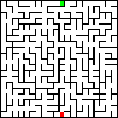
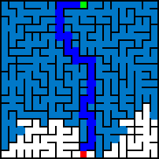

# Mazer
A minimalist commandline interface maze generator and solver. Note that all mazes generated are true traditional mazes where each cell is visited once. This was created as part of a project for Professor Nadia Ahmed's CS1D class to demonstrate maze generation and path finding algorithms.

## How to download
- You can download the release.zip from the releases tab
- You can run ```git clone "https://github.com/rhellwege/Mazer.git"```


IDEA: CTRL + MOUSE DRAG CHANGE EITHER START OR FINISH
IDEA: MOUSEWHEEL CONTROLS ZOOM

## How to build
### Linux
1. install make and gcc with brew if they aren't installed already ```sudo apt install gcc make``` or ```sudo pacman -S g++ make```
2. build with the command ```make```
### Mac
1. install make and gcc with brew if they aren't installed already ```brew install gcc make```
2. build with the command ```make```
### Windows
Unfortunately this project is currently not buildable on windows, however you can use Windows Subsystem for Linux [(wsl)](https://docs.microsoft.com/en-us/windows/wsl/install)
## How to run
run mazer in the commandline with options

Arg | Purpose
--- | -------------
-g | generator algorithm *(DFS by default)*
-s | solving algorithm *(DFS by default)* 
-n | makes it so mazer doesnt save any gifs
-w | width of cells the generated maze will have *(20 by default)*
-h | height of cells the generated maze will have *(20 by default)*
-r | choose the seed for random generation *(will change everytime by default)*
-d | sets the delay of the gifs *in milliseconds*
-o | specifies the directory mazer will output pictures and gifs to *(Mazer_output/ by default)*
-c | sets the width of each cell in pixels *(8 pixels by default)*
-l | sets the width of the walls *(2 pixels by default)*

### Example commands:
```bash
./mazer -w 10 -h 10 -g dfs -s bfs -o dfs-bfs_test/
```
```bash
./mazer -g prims -w 50 -h 50 -c 1 -l 1 -s astar -r 1
```

## Supported Algorithms:
### Generating:
1. DFS
2. Kruskal
3. Prim's
### Solving:
1. DFS
2. BFS
3. Dijkstra
4. A*

## Output
Each generated image is color coded.

> **White** represents an unvisited cell.
> **Black** represents a wall
> **Dark blue** represents the correct path
> *Light blue* represents a tile that was visited during the solving phase
>   but is not included in the final path.
> *Green* represents the starting cell, and **Red** represents the ending cell.

The directory will include two png files (generation and solve) as well as two gifs

Additionally a text file will be included with the seed of the generation so you can reuse it for testing.



.gif)
.gif)

## Credit
1. For png writing I used [stb](https://github.com/nothings/stb)
2. For gif writing I used [gif-h](https://github.com/charlietangora/gif-h)
3. This [blog](https://weblog.jamisbuck.org/) was really useful for understanding the maze generation algorithms

## Algorithms:
> All of the following code is taken directly from the project but has gif writing and image updating removed, and no step counting. If you want to see the methods, look at Maze.cpp starting from line 52 onwards.
### Generation:
#### DFS
```c++
void Maze::dfsGenHelper(Cell* c) {
    if (c->seen()) return;
    c->visit();
    
    Cell* nextCell = c->randomNeighbour();
    while (nextCell != nullptr) {
        c->destroyBorder(nextCell);
        dfsGenHelper(nextCell);
        nextCell = c->randomNeighbour();
    }
}

void Maze::genDFS() {
    dfsGenHelper(start);
}
```
#### Kruskal
```c++
Cell* Maze::setFind(std::unordered_map<Cell*, Cell*>& s, Cell* c) {
    if (s[c] == c) return c;
    return setFind(s, s[c]);
}

void Maze::setUnion(std::unordered_map<Cell*, Cell*>& s, Cell* a, Cell* b) {
    Cell* aParent = setFind(s, a);
    Cell* bParent = setFind(s, b);
    s[aParent] = bParent;
}

void Maze::genKruskal() {
    std::vector<std::pair<Cell*, Cell*>> edges;
    std::unordered_map<Cell*, Cell*> sets;
    int wallsDown = 0;
    for (int i = 0; i < W ; ++i) {
        for (int j = 0; j < H; ++j) {
            Cell* c = getCell(i, j);
            sets[c] = c;
            if (i < W - 1)
                edges.push_back(std::make_pair(c, getCell(i + 1, j)));
            if (j < H - 1)
                edges.push_back(std::make_pair(c, getCell(i, j+1)));
        }
    }
    //shuffle the edges:
    std::shuffle(edges.begin(), edges.end(), std::default_random_engine{seed});
    // kruskal
    while (edges.size() && wallsDown < W*H-1) {
        std::pair<Cell*, Cell*> cur = edges[edges.size()-1]; edges.pop_back();
        if (setFind(sets, cur.first) != setFind(sets, cur.second)) {
            setUnion(sets, cur.first, cur.second); // union the sets
            cur.first->destroyBorder(cur.second);
            wallsDown++;
        }
    }
}
```

#### Prim's
```c++
void addFrontier(Cell* c, std::deque<Cell*>& frontier, std::unordered_set<Cell*>& fset) {
    if (fset.find(c) != fset.end()) {
        printf("already in fset.\n");
        return;
    }
    frontier.push_back(c);
    fset.insert(c);
}

void addMst(Cell* c, int idx, std::deque<Cell*>& frontier, std::unordered_set<Cell*>& fset, std::unordered_set<Cell*>& mst) {
    if (mst.find(c) != mst.end()) return;
    if (fset.find(c) != fset.end())
        fset.erase(c);
    if (idx != -1) {
        frontier.erase(frontier.begin() + idx);
    }
    mst.insert(c);
    std::vector<Cell*> neighbours = c->unvisitedNeighbours();
    for (auto n : neighbours) {
        if (fset.find(n) == fset.end()) {
            addFrontier(n, frontier, fset);
        }
    }

}

void Maze::genPrims() {
    std::unordered_set<Cell*> mst; // minimal spanning tree
    std::deque<Cell*> frontier; // all cells adjacent to the mst
    std::unordered_set<Cell*> fset;
    addMst(start, -1, frontier, fset, mst);
    start->visit();
    while (frontier.size()) {
        // choose random frontier
        int idx = rand() % frontier.size();
        Cell* c = frontier[idx];
        addMst(c, idx, frontier, fset, mst);
        // destroy the walls of one of the adjacent mst nodes (at random)
        c->visit();
        std::vector<Cell*> ins = c->visitedNeighbours();
        Cell* neighbour = ins[rand() % ins.size()];
        c->destroyBorder(neighbour);
    }
}
```

### Solving:
#### DFS
```c++
bool Maze::solveDFSHelper(Cell* c) {
    if (c == finish) return true;
    if (c->getVal() == CELL_PATH) return false;
    if (c != start)
        c->setVal(CELL_PATH);
    std::vector<Cell*> accessible = c->accessibleNeighbours();
    for (auto n : accessible) 
        if (solveDFSHelper(n)) return true;
    if (c != start)
        c->setVal(CELL_WASTED);
    return false;
}

void Maze::solveDFS() {
    solveDFSHelper(start);
}
```
#### BFS
```c++
void Maze::solveBFS() {
    std::queue<Cell*> q;
    std::unordered_map<Cell*, Cell*> path;
    Cell* current = start;
    while (current != finish) {
        if (current != start)
            current->setVal(CELL_WASTED);
        
        std::vector<Cell*> neighbours = current->accessibleNeighbours();
        for (auto neighbour : neighbours) {
            if (neighbour->getVal() != CELL_WASTED)  {
                q.push(neighbour);
                path[neighbour] = current;
            }
        }
        current = q.front(); q.pop();
    }
    while (current != start) {
        current = path[current];
        if (current == start) break;
        current->setVal(CELL_PATH);
    }
}
```
#### Dijkstra
```c++
void Maze::solveDijkstra() {
    std::unordered_map<Cell*, unsigned int> distance;
    std::unordered_map<Cell*, Cell*> prev;
    std::priority_queue<std::pair<unsigned int, Cell*>, std::vector<std::pair<unsigned int, Cell*>>, std::greater<std::pair<unsigned int, Cell*>>> pq;
    distance[start] = 0;
    for (int i = 0; i < W ; ++i) {
        for (int j = 0; j < H; ++j) {
            Cell* c = getCell(i, j);
            if (c != start) {
                distance[c] = INT_MAX;
            }
        }
    }
    pq.push(std::make_pair(0, start));
    while (!pq.empty()) {
        Cell* u = pq.top().second;
        if (u == finish) {
            break;
        }
        if (u != start)
            u->setVal(CELL_WASTED);
        pq.pop();
        std::vector<Cell*> neighbours = u->accessibleNeighbours();
        for (auto v : neighbours) {
            if (distance[v] > distance[u] + 1) {
                distance[v] = distance[u] + 1;
                prev[v] = u;
                pq.push(std::make_pair(distance[v], v));
            }
        }
    }
    // color path
    Cell* cur = prev[finish];
    while (cur != start) {
        cur->setVal(CELL_PATH);
        cur = prev[cur];
    }
}
```
#### A*
```c++
double Maze::distCell(Cell* a, Cell* b) {
    std::pair<double, double> diff = std::make_pair(b->getX() - a->getX(), b->getY() - a->getY());
    return sqrt(diff.first*diff.first + diff.second*diff.second);
}

void Maze::solveAStar() {
    std::unordered_map<Cell*, double> cost;
    std::unordered_map<Cell*, Cell*> prev;
    std::priority_queue<std::pair<double, Cell*>, std::vector<std::pair<double, Cell*>>, std::greater<std::pair<double, Cell*>>> pq;
    cost[start] = 0 + distCell(start, finish);
    for (int i = 0; i < W ; ++i) {
        for (int j = 0; j < H; ++j) {
            Cell* c = getCell(i, j);
            if (c != start) {
                cost[c] = INT_MAX;
            }
        }
    }
    pq.push(std::make_pair(0, start));
    while (!pq.empty()) {
        Cell* u = pq.top().second;
        if (u == finish) {
            break;
        }
        if (u != start)
            u->setVal(CELL_WASTED);
        pq.pop();
        std::vector<Cell*> neighbours = u->accessibleNeighbours();
        for (auto v : neighbours) {
            if (cost[v] > cost[u] + distCell(u, finish)) {
                cost[v] = cost[u] + distCell(u, finish);
                prev[v] = u;
                pq.push(std::make_pair(cost[v], v));
            }
        }
    }
    // color path
    Cell* cur = prev[finish];
    while (cur != start) {
        cur->setVal(CELL_PATH);
        cur = prev[cur];
    }
}
```