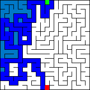

# Mazer
A minimalist commandline interface maze generator and solver. Note that all mazes generated are true traditional mazes where each cell is visited once.

## How to build
Make sure you have make installed, and simply run make in the console in this directory.
I'm pretty sure this is only buildable on linux.

## How to run
run mazer in the commandline with options

Arg | Purpose
--- | -------------
-w | width of cells the generated maze will have *(20 by default)*
-h | height of cells the generated maze will have *(20 by default)*
-g | generator algorithm *(DFS by default)*
-s | solving algorithm *(DFS by default)*
-o | specifies the directory mazer will output pictures and gifs to *(./ by default)*
--no-gif | makes it so mazer doesnt save any gifs
--seed | choose the seed for random generation (will change everytime)

### Example command:
```bash
./mazer -w 10 -h 10 -g DFS -s DFS -o DFS/
```

## Output
Each generated image is color coded.

> **White** represents an unvisited cell.
> **Black** represents a wall
> **Dark blue** represents the correct path
> *Light blue* represents a tile that was visited during the solving phase
>   but is not included in the final path.
> *Green* represents the starting cell, and **Red** represents the ending cell.

The directory will include two png files
> solved.png + unsolved.png. 

On top of that there will be two gifs generated: 
>mazegen.gif + solve.gif

Additionally a text file will be included with the seed of the generation so you can reuse it for testing.



## Credit
For image writing I used [stb](https://github.com/nothings/stb)

## TODO
- [ ] getopt commandline options
- [ ] khruskhal generation
- [ ] animated gif