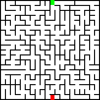

# Mazer
A minimalist commandline interface maze generator and solver. Note that all mazes generated are true traditional mazes where each cell is visited once. This was created as part of a project for Professor Nadia Ahmed's CS1D class to demonstrate path finding algorithims.

## How to build
### Linux
1. install make and gcc with brew if they aren't installed already ```sudo apt install gcc make``` or ```sudo pacman -S gcc make```
2. build with the command ```make```
### Mac
1. install make and gcc with brew if they aren't installed already ```brew install gcc make```
2. build with the command ```make```
### Windows

## How to run
run mazer in the commandline with options

Arg | Purpose
--- | -------------
-g | generator algorithm *(DFS by default)*
-s | solving algorithm *(DFS by default)* 
-n | makes it so mazer doesnt save any gifs
-w | width of cells the generated maze will have *(20 by default)*
-h | height of cells the generated maze will have *(20 by default)*
-r | choose the seed for random generation *(will change everytime by default)*
-d | sets the delay of the gifs *in milliseconds*
-o | specifies the directory mazer will output pictures and gifs to *(./ by default)*
-c | sets the width of each cell in pixels *(8 pixels by default)*
-l | sets the width of the walls *(2 pixels by default)*

### Example commands:
```bash
./mazer -w 10 -h 10 -g DFS -s DFS -o DFS/
```
```bash
./mazer -g kruskal -s dijkstra -o ./
```

## Output
Each generated image is color coded.

> **White** represents an unvisited cell.
> **Black** represents a wall
> **Dark blue** represents the correct path
> *Light blue* represents a tile that was visited during the solving phase
>   but is not included in the final path.
> *Green* represents the starting cell, and **Red** represents the ending cell.

The directory will include two png files
> solved.png + unsolved.png. 

On top of that there will be two gifs generated: 
>mazegen.gif + solve.gif

Additionally a text file will be included with the seed of the generation so you can reuse it for testing.



.gif)
.gif)

## Credit
1. For png writing I used [stb](https://github.com/nothings/stb)
2. For gif writing I used [gif-h](https://github.com/charlietangora/gif-h)

## Algorithims:
### Generation:
#### dfs
```c++
void Maze::dfsGenHelper(Cell* c) {
    if (c->seen()) return;
    c->visit();
    
    Cell* nextCell = c->randomNeighbour();
    while (nextCell != nullptr) {
        c->destroyBorder(nextCell);
        updateBorderPixels(c, c->directionFromNeighbour(nextCell), COLOR_WHITE);
        if (saveGif) {
            addFrame();
        }
        dfsGenHelper(nextCell);
        nextCell = c->randomNeighbour();
    }
}

void Maze::genDFS() {
    if (saveGif) startGif((dir + "gen(dfs).gif").c_str());
    dfsGenHelper(start);
    if (!saveGif)
        updateImage();
}
```
#### kruskal
```c++
Cell* Maze::setFind(std::unordered_map<Cell*, Cell*>& s, Cell* c) {
    if (s[c] == c) return c;
    return setFind(s, s[c]);
}

void Maze::setUnion(std::unordered_map<Cell*, Cell*>& s, Cell* a, Cell* b) {
    Cell* aParent = setFind(s, a);
    Cell* bParent = setFind(s, b);
    s[aParent] = bParent;
}

void Maze::genKruskal() {
    if (saveGif) startGif((dir + "gen(kruskal).gif").c_str());
    std::vector<std::pair<Cell*, Cell*>> edges;
    std::unordered_map<Cell*, Cell*> sets;
    int wallsDown = 0;
    for (int i = 0; i < W ; ++i) {
        for (int j = 0; j < H; ++j) {
            Cell* c = getCell(i, j);
            sets[c] = c;
            if (i < W - 1)
                edges.push_back(std::make_pair(c, getCell(i + 1, j)));
            if (j < H - 1)
                edges.push_back(std::make_pair(c, getCell(i, j+1)));
        }
    }
    //shuffle the edges:
    std::shuffle(edges.begin(), edges.end(), std::default_random_engine{seed});
    // kruskal
    while (edges.size() && wallsDown < W*H-1) {
        std::pair<Cell*, Cell*> cur = edges[edges.size()-1]; edges.pop_back();
        if (setFind(sets, cur.first) != setFind(sets, cur.second)) {
            setUnion(sets, cur.first, cur.second); // union the sets
            cur.first->destroyBorder(cur.second);
            updateBorderPixels(cur.first, cur.first->directionFromNeighbour(cur.second), COLOR_WHITE);
            if (saveGif) addFrame();
            wallsDown++;
        }
    }
    if (!saveGif)
        updateImage();
}
```

### Solving:
#### dfs
```c++
bool Maze::solveDFSHelper(Cell* c) {
    if (c == finish) return true;
    if (c->getVal() == CELL_PATH) return false;
    if (c != start)
        c->setVal(CELL_PATH);
    if (saveGif) {
        updateCellCol(c);
        addFrame();
    }
    std::vector<Cell*> accessible = c->accessibleNeighbours();
    for (auto n : accessible) 
        if (solveDFSHelper(n)) return true;
    if (c != start)
        c->setVal(CELL_WASTED);
    if (saveGif) {
        updateCellCol(c);
        addFrame();
    }
    return false;
}

void Maze::solveDFS() {
    if (saveGif) startGif((dir + "solve(DFS).gif").c_str());
    solveDFSHelper(start);
    if (!saveGif) updateImage();
    if (saveGif) endGif();
}
```
#### bfs
```c++
void Maze::solveBFS() {
    if (saveGif) startGif((dir +"solve(BFS).gif").c_str());
    std::queue<Cell*> q;
    std::unordered_map<Cell*, Cell*> path;
    Cell* current = start;
    while (current != finish) {
        
        if (current != start)
            current->setVal(CELL_WASTED);
        if (saveGif) {
            updateCellCol(current);
            addFrame();
        }
        std::vector<Cell*> neighbours = current->accessibleNeighbours();
        for (auto neighbour : neighbours) {
            if (neighbour->getVal() != CELL_WASTED)  {
                q.push(neighbour);
                path[neighbour] = current;
            }
        }
        current = q.front(); q.pop();
    }
    while (current != start) {
        current = path[current];
        if (current == start) break;
        current->setVal(CELL_PATH);
        if (saveGif) {
            updateCellCol(current);
            addFrame();
        }
    }
    if (!saveGif) updateImage();
    if (saveGif) endGif();
}
```
#### dijkstra
```c++
void Maze::solveDijkstra() {
    if (saveGif) startGif((dir + "solve(Dijkstra).gif").c_str());
    std::unordered_map<Cell*, unsigned int> distance;
    std::unordered_map<Cell*, Cell*> prev;
    std::priority_queue<std::pair<unsigned int, Cell*>, std::vector<std::pair<unsigned int, Cell*>>, std::greater<std::pair<unsigned int, Cell*>>> pq;
    distance[start] = 0;
    for (int i = 0; i < W ; ++i) {
        for (int j = 0; j < H; ++j) {
            Cell* c = getCell(i, j);
            if (c != start) {
                distance[c] = INT_MAX;
            }
        }
    }
    pq.push(std::make_pair(0, start));
    while (!pq.empty()) {
        Cell* u = pq.top().second;
        if (u == finish) {
            break;
        }
        if (u != start)
            u->setVal(CELL_WASTED);
        if (saveGif) {
            updateCellCol(u);
            addFrame();
        }
        pq.pop();
        std::vector<Cell*> neighbours = u->accessibleNeighbours();
        for (auto v : neighbours) {
            
            if (distance[v] > distance[u] + 1) {
                distance[v] = distance[u] + 1;
                prev[v] = u;
                pq.push(std::make_pair(distance[v], v));
            }
        }
    }
    // color path
    Cell* cur = prev[finish];
    while (cur != start) {
        cur->setVal(CELL_PATH);
        if (saveGif) {
            updateCellCol(cur);
            addFrame();
        }
        cur = prev[cur];
    }
    if (!saveGif) updateImage();
    if (saveGif) endGif();
}
```
#### A*
```c++
int Maze::distCell(Cell* a, Cell* b) {
    std::pair<int, int> diff = std::make_pair(b->getX() - a->getX(), b->getY() - a->getY());
    return sqrt(diff.first*diff.first + diff.second*diff.second);
}

void Maze::solveAStar() {
    if (saveGif) startGif((dir + "solve(Astar).gif").c_str());
    std::unordered_map<Cell*, unsigned int> cost;
    std::unordered_map<Cell*, Cell*> prev;
    std::priority_queue<std::pair<unsigned int, Cell*>, std::vector<std::pair<unsigned int, Cell*>>, std::greater<std::pair<unsigned int, Cell*>>> pq;
    cost[start] = 0 + distCell(start, finish);
    for (int i = 0; i < W ; ++i) {
        for (int j = 0; j < H; ++j) {
            Cell* c = getCell(i, j);
            if (c != start) {
                cost[c] = INT_MAX;
            }
        }
    }
    pq.push(std::make_pair(0, start));
    while (!pq.empty()) {
        Cell* u = pq.top().second;
        if (u == finish) {
            break;
        }
        if (u != start)
            u->setVal(CELL_WASTED);
        if (saveGif) {
            updateCellCol(u);
            addFrame();
        }
        pq.pop();
        std::vector<Cell*> neighbours = u->accessibleNeighbours();
        for (auto v : neighbours) {
            if (cost[v] > cost[u] + distCell(u, finish)) {
                cost[v] = cost[u] + distCell(u, finish);
                prev[v] = u;
                pq.push(std::make_pair(cost[v], v));
            }
        }
    }
    // color path
    Cell* cur = prev[finish];
    while (cur != start) {
        cur->setVal(CELL_PATH);
        if (saveGif) {
            updateCellCol(cur);
            addFrame();
        }
        cur = prev[cur];
    }
    if (!saveGif) updateImage();
    if (saveGif) endGif();
}
```