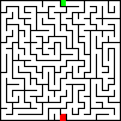
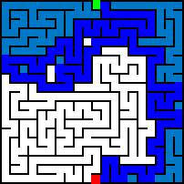
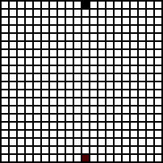
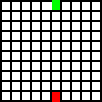

# Mazer
A minimalist commandline interface maze generator and solver. Note that all mazes generated are true traditional mazes where each cell is visited once. This was created as part of a project for Professor Nadia Ahmed's CS1D class to demonstrate path finding algorithims.

## How to build
### Linux
1. install make and gcc with brew if they aren't installed already
2. build with the command ```bash make```
### Mac
1. install make and gcc with brew if they aren't installed already ```bash brew install gcc make```
### Windows

## How to run
run mazer in the commandline with options

Arg | Purpose
--- | -------------
--generator | generator algorithm *(DFS by default)*
--solver | solving algorithm *(DFS by default)* 
--no-gif | makes it so mazer doesnt save any gifs
-w | width of cells the generated maze will have *(20 by default)*
-h | height of cells the generated maze will have *(20 by default)*
-s | choose the seed for random generation *(will change everytime by default)*
-d | sets the delay of the gifs *in milliseconds*
-o | specifies the directory mazer will output pictures and gifs to *(./ by default)*

### Example commands:
```bash
./mazer -w 10 -h 10 --generator DFS --solver DFS -o DFS/
```
```bash
./mazer --generator khruskals --solver dijkstra -o ./
```

## Output
Each generated image is color coded.

> **White** represents an unvisited cell.
> **Black** represents a wall
> **Dark blue** represents the correct path
> *Light blue* represents a tile that was visited during the solving phase
>   but is not included in the final path.
> *Green* represents the starting cell, and **Red** represents the ending cell.

The directory will include two png files
> solved.png + unsolved.png. 

On top of that there will be two gifs generated: 
>mazegen.gif + solve.gif

Additionally a text file will be included with the seed of the generation so you can reuse it for testing.






## Credit
1. For png writing I used [stb](https://github.com/nothings/stb)
2. For gif writing I used [gif-h](https://github.com/charlietangora/gif-h)

## TODO
- [ ] support 4 channels so gifs are compatible
- [ ] getopt commandline options
- [ ] khruskhal generation
- [ ] animated gif